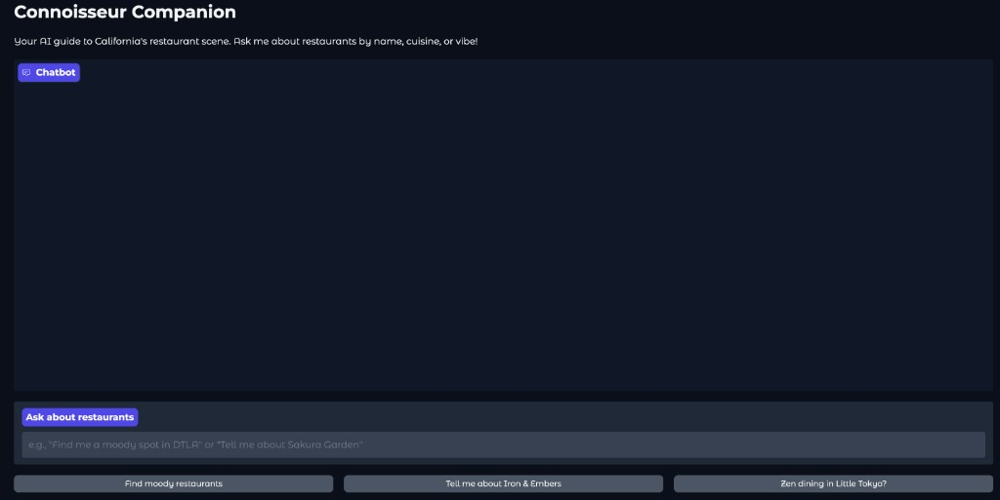
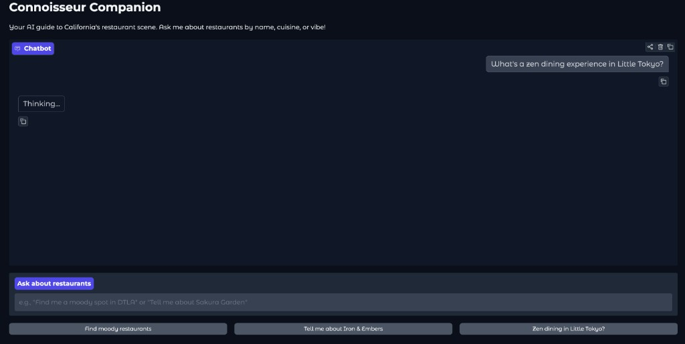
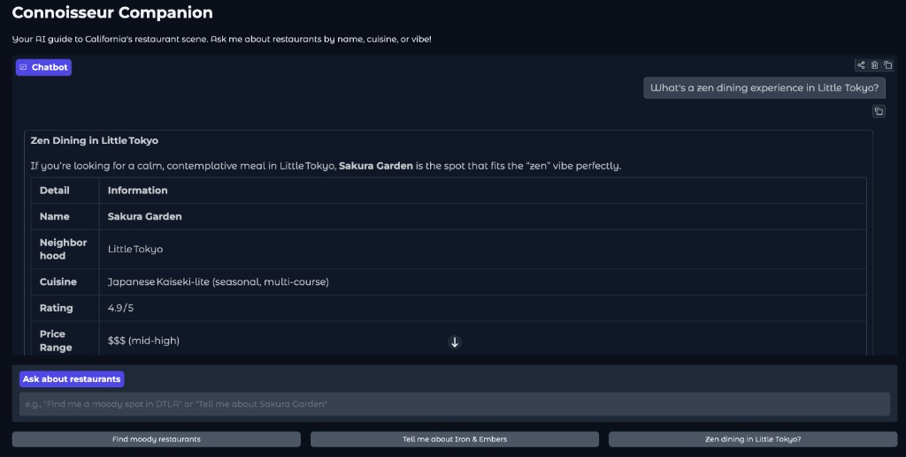
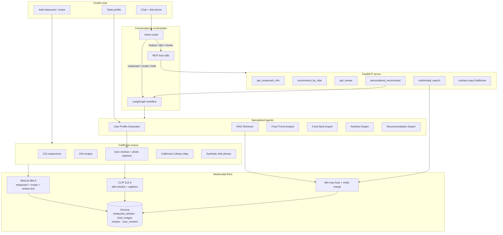
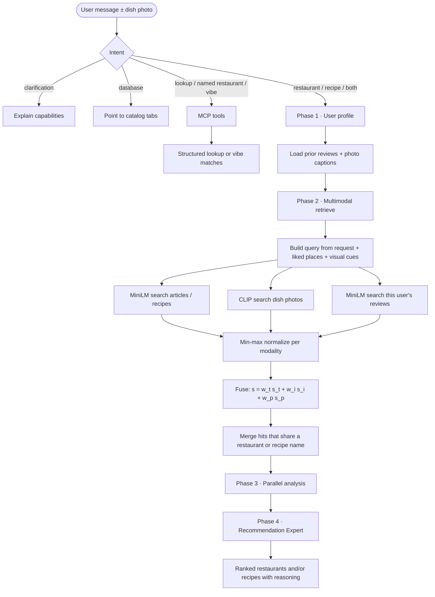
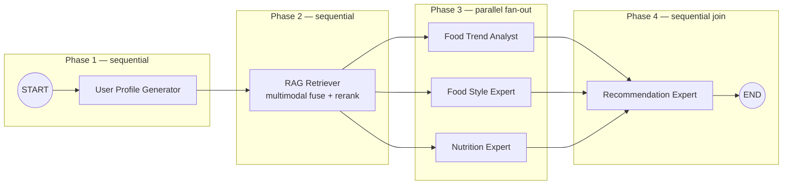

# Personalized Dining And Recipe Recommender

Production system for **California restaurant discovery** and **home-cooking recipes**, combining:

- **Multimodal RAG** — Sentence-Transformers text embeddings + CLIP image embeddings
- **Fusion reranking** — calibrated text, dish-photo, and user-preference scores
- **Personalization** — prior reviews and food photos for the active user
- **LangGraph multi-agent orchestration** — six specialists with a parallel analysis phase
- **MCP tool calling** — lookup, vibe search, reviews, and recommendation tools
- **Gradio UI** — chat, photo upload, taste profile, and catalog edits

The runnable product lives in [`src/pdr`](src/pdr).

---

## Demo

Gradio **Connoisseur Companion** — empty chat, agent reasoning, then a structured California restaurant answer.

### 1. Initial UI

Empty session with vibe-oriented starters for California dining.



### 2. Model's Reasoning UI

The host shows **Thinking...** while LangGraph runs multimodal RAG and the specialist agents.



### 3. Result UI

A zen Little Tokyo query resolved to **Sakura Garden**, with neighborhood, cuisine, rating, and price in a structured table.



---

## What this system does

A diner describes a craving, a vibe, a neighborhood, or a dietary constraint — and can optionally upload a dish photo. The system:

1. Rebuilds their taste profile from **previous reviews and photo captions**
2. Retrieves California restaurant copy and recipe/dish evidence from **two embedding spaces**
3. **Reranks** a single list so a place that matches both the write-up *and* the look of the food can beat a text-only hit
4. Runs culinary **trend, style, and nutrition** specialists in parallel
5. Returns restaurant and/or recipe recommendations with reasons grounded in that evidence

Default personalization user: `USER_FUSION_FINDER_99` (the synthetic California reviewer in the bundled data).

---

## Architecture



### Embedding spaces

| Modality | Model | Dim | Indexed content |
|---|---|---|---|
| Text | `all-MiniLM-L6-v2` | 384 | California restaurant records, culinary-map paragraphs, recipes, user review text |
| Vision | `openai/clip-vit-base-patch32` | 512 | Dish photos when present; otherwise CLIP **text** embeddings of image captions (same space, so a typed query or an uploaded plate can both search photos) |

Chroma stores four collections under `chroma_db/`: `restaurant_articles`, `food_images`, `recipes`, `user_reviews`.

---

## Logic flowchart (request → recommendation)



### Fusion reranking

Text (MiniLM), image (CLIP), and preference (this user's reviews/photos) are **not** on the same raw scale. Each list is min-max normalized, then combined:

\[
s_{\text{fused}} = w_{\text{text}}\,\hat{s}_{\text{text}} + w_{\text{img}}\,\hat{s}_{\text{img}} + w_{\text{pref}}\,\hat{s}_{\text{pref}}
\]

Defaults: `w_text = 0.55`, `w_img = 0.30`, `w_pref = 0.15` (override with `PDR_FUSION_*_WEIGHT`). Hits that share a restaurant/recipe **name** are merged so dual-modality evidence ranks above a single-channel match. Reciprocal Rank Fusion is also available in `pdr.rag.fusion.reciprocal_rank_fusion` for rank-based ensembles.

---

## Multi-agent orchestration (LangGraph)

Six personas from the original agent design, now a real **StateGraph** with shared `AgentState`.



LangGraph waits on **all three** Phase 3 edges before the Recommendation Expert runs, so trend, style, and nutrition insights are complete before synthesis.

| Agent | Reads | Writes |
|---|---|---|
| User Profile Generator | Live prompt + prior reviews/photos | `user_profile`, `preference_query` |
| RAG Retriever | Profile + optional uploaded image | `retrieved_restaurants`, `retrieved_recipes`, `fused_hits` |
| Food Trend Analyst | Candidate slice | `trend_analysis` |
| Food Style Expert | Profile + candidates | `style_analysis` |
| Nutrition Expert | Dietary constraints + candidates | `nutrition_analysis` |
| Recommendation Expert | Entire state | `final_recommendations` |

MCP tools the host can call without running the full graph:

- `get_restaurant_info` — structured California restaurant record
- `recommend_by_vibe` — keyword + fused multimodal rerank
- `get_review` — that user's review and photo captions
- `multimodal_search` — fused RAG only
- `personalized_recommend` — full LangGraph run
- resource `culinary-map://california` — raw map text

---

## Repository layout

```text
.
├── app.py / server.py / client.py     # thin root launchers
├── src/pdr/
│   ├── config.py                      # environment + paths
│   ├── llm.py                         # watsonx or OpenAI
│   ├── data/                          # schemas + loaders
│   ├── rag/                           # embeddings, Chroma, fusion
│   ├── preference/                    # review + photo profile
│   ├── agents/                        # LangGraph graph + nodes
│   ├── mcp/server.py                  # FastMCP tools
│   └── ui/app.py                      # Gradio
├── data/processed/                    # restaurants, recipes, reviews
├── data/raw/                          # culinary map + dish-photo zip
├── scripts/ingest.py                  # build vector indexes
├── tests/
└── docs/screenshots/                  # Gradio demo captures
```

---

## Quick start

### 1. Install

```bash
python3.12 -m venv .venv
source .venv/bin/activate
pip install -e ".[dev]"
```

On Apple Silicon, install CPU or MPS PyTorch first if the default wheel is wrong for your machine.

### 2. Configure

```bash
cp .env.example .env
```

Set **either**:

- IBM watsonx: `WATSONX_APIKEY`, `WATSONX_PROJECT_ID` (`PDR_LLM_PROVIDER=watsonx`)
- OpenAI: `OPENAI_API_KEY` and `PDR_LLM_PROVIDER=openai`

Retrieval still works without an LLM. Agent synthesis then uses deterministic fallbacks built from fused scores.

### 3. Index the corpus

```bash
python scripts/ingest.py
```

This unzips dish photos when needed, embeds text with MiniLM, embeds photos (or captions) with CLIP, and writes `chroma_db/`.

### 4. Run the UI

```bash
python app.py
# or
python scripts/run_ui.py
```

Open the printed local URL. Try:

- `Find me a moody restaurant in DTLA`
- `Tell me about Iron & Embers`
- `Vegetarian recipes I can cook this week`
- Upload a plate photo and ask for similar restaurants or recipes

### 5. Run the MCP server (optional host)

```bash
python server.py
# smoke-test tools
python client.py
```

---

## Tests

```bash
pytest -q
```

Coverage includes fusion/rerank math, California catalog loading, preference-profile construction, Gradio formatters, and LangGraph node presence (including the Phase 3 fan-out).

---

## Configuration reference

| Variable | Default | Role |
|---|---|---|
| `PDR_LLM_PROVIDER` | `watsonx` | `watsonx` or `openai` |
| `PDR_WATSONX_MODEL` | `ibm/granite-4-h-small` | Chat model for agents |
| `PDR_OPENAI_MODEL` | `gpt-4o-mini` | Alternate chat model |
| `PDR_CHROMA_DIR` | `chroma_db` | Persistent vector store |
| `PDR_FUSION_TEXT_WEIGHT` | `0.55` | Article/recipe channel |
| `PDR_FUSION_IMAGE_WEIGHT` | `0.30` | Dish-photo channel |
| `PDR_FUSION_PREF_WEIGHT` | `0.15` | Prior review/photo channel |
| `PDR_DEFAULT_USER_ID` | `USER_FUSION_FINDER_99` | Personalization identity |

---

## Data

| File | Use |
|---|---|
| `data/processed/structured_restaurant_data.json` | 210 structured California restaurants |
| `data/processed/structured-restaurant-data.json` | Vibe/neighborhood overlay |
| `data/processed/augmented_food_recipe.json` | 109 recipes with image descriptions |
| `data/processed/augmented_user_review.json` | User reviews, image URLs, captions |
| `data/raw/California-Culinary-Map.txt` | Unstructured restaurant narratives |
| `data/raw/synthetic-recipe-images.zip` | Dish photos for CLIP |

After adding rows in the UI, run `python scripts/ingest.py` again so Chroma stays in sync.

---

## Design notes

- **Preference is retrieval, not a post-hoc filter.** Liked reviews and photo captions are concatenated into the RAG query and also searched as their own review index, then fused.
- **Photos without files still participate.** CLIP text embeddings of captions live in `food_images`, so visual queries work before the zip is extracted and after captions-only reviews.
- **Agents never invent the candidate pool.** Phase 3/4 reason over fused hits from California data. If watsonx/OpenAI is down, the Recommendation Expert still returns those hits with score-based reasoning.
- **MCP and LangGraph are complementary.** Lookups go through tools; personalized ranking goes through the graph (`personalized_recommend` is the MCP façade for that graph).
